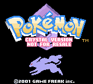
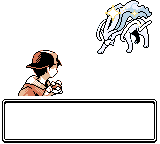
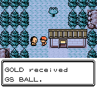
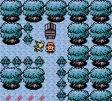
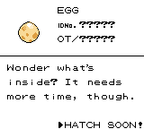
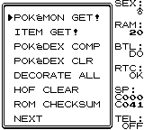

# Pokémon Crystal Not For Resale

Hack of: Pokémon Crystal

This hack imagines if the "Not For Resale" Version wasn't the same as the final release.

It builds the following ROMs:

- Pokemon - Crystal Version (UE) (V1.0) [C][!].gbc `sha1: f4cd194bdee0d04ca4eac29e09b8e4e9d818c133`
- Pokemon - Crystal Version (UE) (V1.1) [C][!].gbc `sha1: f2f52230b536214ef7c9924f483392993e226cfb`
- Pokemon - Crystal Version (A) [C][!].gbc `sha1: a0fc810f1d4e124434f7be2c989ab5b5892ddf36`
- CRYSTAL_ps3_010328d.bin `sha1: c60d57a24bbe8ecf7cba54ab3f90669f97bd330d`
- CRYSTAL_ps3_us_revise_010710d.bin `sha1: 391ae86b1d5a26db712ffe6c28bbf2a1f804c3c4`

To set up the repository, see [INSTALL.md](INSTALL.md).
Keep in mind that this is an already old version of Pokecrystal.

Features:
- New text on Title Screen.
- GS Ball Event can be activated after beating the League just like in the Virtual Console release.
- Suicune in Tin Tower has a 50/50 possibilities of being Shiny.
- Debug Room is accesible by pressing A.

To do:
- Fix the Pokémon Get! Debug function. (Player Gender, Pokémon Nickname)

# Screenshots

# Credits
- **Rangi** for helping me with the Title screen.

## See also

- [**FAQ**](FAQ.md)
- [**Documentation**][docs]
- [**Wiki**][wiki] (includes [tutorials][tutorials])
- **Discord:** [pret][discord]
- **IRC:** [libera#pret][irc]

Other disassembly projects:

- [**Pokémon Red/Blue**][pokered]
- [**Pokémon Yellow**][pokeyellow]
- [**Pokémon Gold/Silver**][pokegold]
- [**Pokémon Crystal**][pokecrystal]
- [**Pokémon Pinball**][pokepinball]
- [**Pokémon TCG**][poketcg]
- [**Pokémon Ruby**][pokeruby]
- [**Pokémon FireRed**][pokefirered]
- [**Pokémon Emerald**][pokeemerald]

[pokered]: https://github.com/pret/pokered
[pokeyellow]: https://github.com/pret/pokeyellow
[pokegold]: https://github.com/pret/pokegold
[pokecrystal]: https://github.com/pret/pokecrystal
[pokepinball]: https://github.com/pret/pokepinball
[poketcg]: https://github.com/pret/poketcg
[pokeruby]: https://github.com/pret/pokeruby
[pokefirered]: https://github.com/pret/pokefirered
[pokeemerald]: https://github.com/pret/pokeemerald
[docs]: https://pret.github.io/pokecrystal/
[wiki]: https://github.com/pret/pokecrystal/wiki
[tutorials]: https://github.com/pret/pokecrystal/wiki/Tutorials
[discord]: https://discord.gg/d5dubZ3
[irc]: https://web.libera.chat/?#pret
[ci]: https://github.com/pret/pokecrystal/actions
[ci-badge]: https://github.com/pret/pokecrystal/actions/workflows/main.yml/badge.svg
